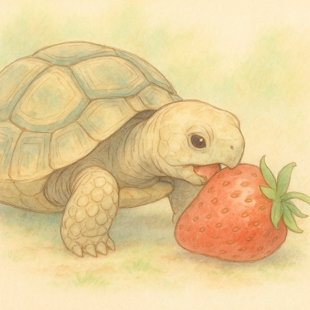
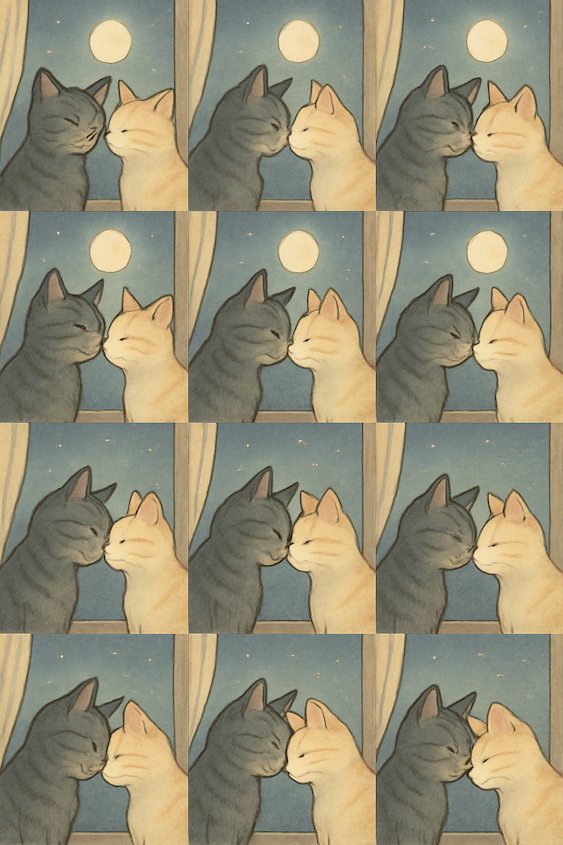
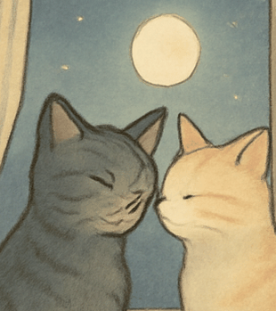
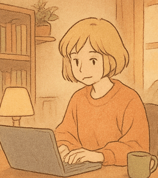

When OpenAI announced [GPT-4o's image generation](https://openai.com/index/introducing-4o-image-generation/) in late March 2025, the internet promptly lost its collective mind. ChatGPT reportedly gained a million new users in a single hour, a velocity that dwarfed its own initial launch which had taken five days to reach the same milestone. I didn't end up trying it until the feature rolled out to free ChatGPT users in late April. By that stage, social media was already flooded with [Studio Ghibli](https://en.wikipedia.org/wiki/Studio_Ghibli)-esque images of friends, family, even pets, all rendered in that distinct, whimsical aesthetic style.

Generating an image with a distinctive Ghibli look is almost trivial. In ChatGPT today you can prompt for:

```
A tortoise eating a strawberry. The art style is soft and hand-drawn, with subtle shading and gentle pastel colors, reminiscent of Studio Ghibli or slice-of-life anime.
```

Wait thirty or so seconds, and you'll receive:



It's not just Ghibli. The model is capable of imitating many other popular artistic styles too such as claymation, pixel art, watercolour illustration, and even the stark look of vintage photography.

Despite wrestling with the legal and ethical implications, and the flood of Ghibli-fied everything across the web, I can't deny the joy of seeing friends and family stylistically depicted. There's something genuinely delightful about the whimsical, slightly painterly realism it can capture.

### Bringing images to life

However, I didn't sit down to start this small project on a particularly wintery Monday evening just to generate static images. What piqued my interest was the idea of bringing these generated images to life. I wanted to animate them.

At a high level, an animation is a sequence of frames displayed in quick succession. Therefore, my initial naive approach was to:

- Prompt for frame 1;
- Prompt for frame 2, describing it as a continuation of frame 1; and
- Repeat N times

This works but it presents two issues.

The first issue is time. Each image generation request takes around 30-45 seconds to process. Crucially, since each frame conceptually depends on the previous one for narrative consistency, you can't easily parallelise this. Generating a mere 10 frames for a very short animation loop would mean waiting sequentially: 10 frames \* ~37.5s/frame = 375 seconds, or over 6 minutes. Not terrible for a one-off, but if you want to test different prompts or create multiple animations, the wait becomes prohibitive.

The second issue is cost. At the time of writing, generating a single image of 1024 x 1024 pixels at medium quality via the API costs roughly $0.04 USD. So, that 10-frame animation would set you back 10 frames \* $0.04/frame = $0.40. Again, fine for a single experiment, but if you want to generate dozens of animations or longer sequences, this adds up very quickly. As much as I enjoy creating fun animations, I wanted an approach that was cost effective too.

### Generating grids

It turns out GPT-4o image generation has another trick up its sleeve, beyond just being a remarkably versatile artistic imitator. OpenAI in their announcement post refers to this feature as "Organized Objects". They provide the following example:

<i>A square image containing a 4 row by 4 column grid containing 16 objects on a white background. Go from left to right, top to bottom. Here's the list...</i>

and then proceed to list 16 objects. The model outputs a single image containing the grid of distinct objects, remarkably well-arranged in the requested orientation.

The ability to reliably position multiple, distinct-yet-related items within a single generated image in a grid is actually quite a sophisticated feat for generative models. Trying to get Stable Diffusion or similar models to do this with high fidelity often results in a delightful mess. What if I could prompt for a grid where each cell was a frame of an animation?

### Prompting for frames

This felt like a promising avenue. For my first few attempts, I used prompts with the following structure:

```
A 3x4 grid of animation frames showing [ANIMATION DESCRIPTION HERE]
```

The results were... okay. Sometimes it worked, sometimes the grid was not of the dimensions that I asked for.

I then modified the prompt to mimic the example prompt that OpenAI had provided more closely. This turned out to be key. My refined prompt structure became:

```
A square image containing a 3 row by 4 column grid. Each cell in the grid is a sequential frame in an animation. The animation shows [ANIMATION DESCRIPTION HERE]
```

This phrasing worked much more consistently - I'd estimate an 85-90% success rate across my admittedly small sample of tests. Occasionally it doesn't, and unfortunately I haven't found a way to improve this.

I also experimented with image dimensions. I found that a 1024 x 1536 dimension for a 3 x 4 grid worked best, using the "medium" quality setting via the API. This produced 12 individual frames, each roughly 1024/4 = 256 by 1536/3 = 512 pixels. The cost for this single generation, producing 12 frames, was around $0.06. That's $0.005 per frame, a significant improvement compared to $0.04 per frame with my initial naive sequential approach!

Here's an example of a generated grid:



```
A square image containing a 3 row by 4 column grid containing 12 panels of a scene as though each panel was a frame in a gif. The scene is of two cats nuzzling under moonlight. Be sure to depict each panel in sequential order. The art style is soft and hand-drawn, with subtle shading and gentle pastel colors, reminiscent of Studio Ghibli or slice-of-life anime.
```

### In search of consistency

My hope was that generating all frames in a single "shot" would improve creative consistency between them. The reality is that the results are mixed, but generally favourable. What I've observed is that the primary subject of the animation tends to remain quite consistent. If it's a cat, it stays looking like the same cat. If it's a person, the person's physical features usually remain stable. The background and minor elements, however, can be much more variable.

Looking at the example grid above, you probably noticed the dramatic background change. The moon vanishes in the last six frames.

When these individual frames are stitched into an animation, these inconsistencies can sometimes be glaring. Other times, especially with faster-moving subjects or more impressionistic styles, they get masked by the motion and contribute to a kind of charming, slightly jittery, hand-made feel. For very smooth, professional-looking animation, this technique obviously isn't the answer. But for quick, fun GIFs, it works surprisingly well.

### From Grid to GIF

With the frames generated as a single image, the next step was to slice them up and stitch them into an animated GIF. This turned out to be straightforward with Python and Pillow.

```python
from PIL import Image
import os


def create_gif_from_grid(
    img_file_name,
    output_path="./generations",
    grid_width=3,
    grid_height=4,
    crop_percent=0.05,
    upscale_factor=1.01,
    duration=150,
):
    """
    Convert a grid of frames in an image to an animated GIF.

    Args:
        img_file_name (str): File name of the input image
        output_path (str): Path for output GIF
        grid_width (int): Number of columns in the grid
        grid_height (int): Number of rows in the grid
        crop_percent (float): Percentage to crop from each side (0.0-0.5)
        upscale_factor (float): Factor to upscale cropped frames
        duration (int): Duration between frames in milliseconds
    """
    img_path = os.path.join(output_path, img_file_name)

    # Input validation
    if not os.path.exists(img_path):
        raise FileNotFoundError(f"Image file not found: {img_path}")

    if crop_percent < 0 or crop_percent >= 0.5:
        raise ValueError("crop_percent must be between 0 and 0.5")

    # Generate output GIF path
    base_name = os.path.splitext(img_file_name)[0]
    gif_output_path = os.path.join(output_path, f"{base_name}.gif")

    try:
        img = Image.open(img_path)

        # Calculate frame dimensions
        frame_width = img.width // grid_width
        frame_height = img.height // grid_height

        if frame_width == 0 or frame_height == 0:
            raise ValueError("Grid size is too large for the image dimensions")

        def crop_and_upscale(frame):
            """Crop and upscale a single frame."""
            crop_margin_w = int(frame.width * crop_percent)
            crop_margin_h = int(frame.height * crop_percent)

            cropped = frame.crop(
                (
                    crop_margin_w,
                    crop_margin_h,
                    frame.width - crop_margin_w,
                    frame.height - crop_margin_h,
                )
            )

            new_size = (
                int(cropped.width * upscale_factor),
                int(cropped.height * upscale_factor),
            )
            return cropped.resize(new_size, Image.LANCZOS)

        # Extract and process frames
        frames = []
        for row in range(grid_height):
            for col in range(grid_width):
                left = col * frame_width
                upper = row * frame_height
                right = left + frame_width
                lower = upper + frame_height

                frame = img.crop((left, upper, right, lower))
                processed_frame = crop_and_upscale(frame)
                frames.append(processed_frame)

        if not frames:
            raise ValueError("No frames were extracted from the image")

        # Save as GIF
        frames[0].save(
            gif_output_path,
            save_all=True,
            append_images=frames[1:],
            optimize=True,
            duration=duration,
            loop=0,
        )

        print(f"GIF created successfully: {gif_output_path}")
        print(f"Generated {len(frames)} frames from {grid_width}x{grid_height} grid")

    except Exception as e:
        print(f"Error creating GIF: {e}")
        raise
```

(You'll need Pillow: `pip install Pillow`)

This script takes the grid image, calculates the dimensions of each sub-image based on the specified rows and columns. It then crops a defined percentage from the edges of each frame (to remove potential grid lines or inconsistencies at the very edges), optionally upscales them slightly, and finally assembles them into an optimised animated GIF.

And here's some example outputs:



.・。.・゜✭・.・✫・゜・。..・。.・゜✭・.・✫・゜・。..・。.・゜✭・.・✫・゜・。.



(notice the vanishing lamp!)

### Try it out!

You can run this Python script on your own computer. Generate your grid image using ChatGPT, save it, and point the script at it.

To make it even more accessible, I've spun up a [small web app](https://gif4o.fly.dev/) where you can try generating these animations directly. It's built with Flask, with Preact and Twind for the frontend (no build step bliss!). I've loaded it with some API credits to get you started, though they may run out depending on how popular this gets. If so, the code is [all on GitHub](https://github.com/mikeesto/gif4o) if you want to run it locally with your own OpenAI API key.

This was a fun little project. It's imperfect, but for me that's what gives it its charm. It's a surprisingly effective way to generate short animation quickly, relatively cheaply, and to share a little joy.
