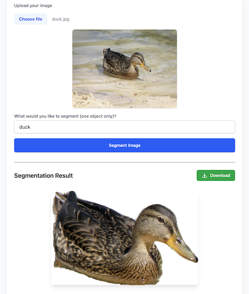

Google's Gemini 2.5 models pack some fascinating multimodal capabilities. While Gemini 2.5 Pro's coding strength and massive context window has been getting a lot of attention recently (and rightfully so!), I've been interested in exploring how they fare with visual understanding.

I've explored Gemini's multimodal capabilities before, building [Gemini Transcribe](https://gemini-transcribe.fly.dev/) about eight months ago for audio transcription with speaker diarization and logically grouped timestamps. That worked pretty well, showcasing its strength beyond text. In my initial testing so far, the preview version of Gemini 2.5 Flash performs even better at generating accurate timestamps.

This time around, what caught my eye was a [Colab notebook](https://colab.research.google.com/github/google-gemini/cookbook/blob/main/quickstarts/Spatial_understanding.ipynb#scrollTo=HxHD1miyLWhK) showing how you could prompt for surprisingly sophisticated spatial reasoning within images. Specifically, it provides examples for:

- Finding all objects within an image
- Searching for a specific object within an image
- Labelling items in an image (including in multiple languages)
- Finding the shadow of an object
- Reasoning about what an object is for
- Drawing bounding boxes of objects (in both 2D and 3D space)
- Providing a mask of the contour of objects

That last point – segmentation masks – felt particularly interesting. Standard computer vision often requires dedicated segmentation models (like Meta's SAM). Could Gemini really do this directly via prompting?

So, I spent a weekend building a small tool to test it out: [Gemini Segment](https://gemini-segment.fly.dev/)



It turns out, yes, Gemini can generate segmentation masks for objects specified in a prompt. From an image input, the model is quite capable of isolating a requested object. The quality can vary, and this particular capability is clearly marked as experimental, but the fact it can perform this kind of task directly is fascinating to me.

The magic prompt, which I took straight from the Colab notebook, is:

```js
`Give the segmentation mask for the ${object}. Output a JSON list of segmentation masks where each entry contains the 2D bounding box in the key "box_2d", and the segmentation mask in key "mask".`;
```

What I would really like to see is a friendlier output from the model. As currently...

<i>The model outputs a list, where each item represents a segmentation mask. Each item has a bounding box ("box_2d") in the format [y0, x0, y1, x1] with normalized coordinates between 0 and 1000, a label ("label") that identifies the object, and lastly the segmentation mask inside the bounding box, as base64 encoded png.

To use the mask, first you need to do base64 decoding, and then loading this string as a png. This will give you a probability map with values between 0 and 255. The mask needs to be resized to match the bounding box dimensions, then you can apply your confidence threshold, e.g. binarizing at 127 for the midpoint. Finally, pad the mask into an array of the size of the full image.</i>

This multi-step process – base64 decoding, loading as PNG, resizing to the bounding box, thresholding, and then padding back to the full image dimensions – feels quite involved for getting a usable mask. You can see my implementation wrestling with this [using ImageMagick here](https://github.com/mikeesto/gemini-segmentation/blob/master/src/routes/api/segment/%2Bserver.ts).
