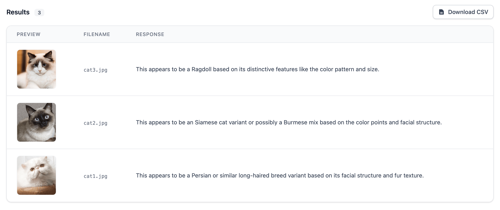

Seven years ago, I built [Guess The Sketch](https://guess-the-sketch.netlify.app/), a small game powered by [sketch-rnn](https://github.com/magenta/magenta/blob/main/magenta/models/sketch_rnn/README.md), a recurrent neural network trained on millions of doodles. The premise is simple: the model draws something, and you try to guess what it is. Using [magenta.js](https://github.com/magenta/magenta-js), the entire thing runs inside your browser. (If you'd like to play, it runs best on a desktop or laptop!)

As someone who is naturally drawn to imperfection, there is something strangely compelling about watching the model try to draw.

Beyond the novelty, it also felt meaningful because of what the web enables. Every phone, tablet, and laptop has a browser. You can share a URL and someone can just... use it. No installation, no app store. That remains one of my favourite things about building for the web.

### Fast Forward to 2025

This week, in that strange liminal space between Christmas and New Year's, I've been working on something new: [Ministral Vision](https://ministralvision.netlify.app/). Instead of an RNN, this uses [Ministral 3B](https://mistral.ai/news/mistral-3), a newly released vision-capable model from Mistral AI. At 3 billion parameters, it's small enough to run entirely in your browser thanks to the standardisation of the [WebGPU API](https://developer.mozilla.org/en-US/docs/Web/API/WebGPU_API), a technology that didn't exist seven years ago.

Ministral Vision lets you upload a zip file of images, enter a prompt (like "describe each image" or "extract the brand name from each image"), and then runs inference right there in your browser. Nothing gets sent to a server. Everything stays local, which makes it both private and free to use. I've put the [source code](https://github.com/mikeesto/ministral-3b-web) up on GitHub.

<i><small>some very important cat analysis</small></i>

### What's Changed (and What Hasn't)

The contrast between these two projects highlights how much has shifted in seven years. Back then, running any neural network in the browser was novel. Now we're casually running 3B parameter vision models with hardware acceleration.

But some things haven't changed. I still find the browser's ubiquity compelling. I still think there's something valuable about tools that respect privacy by default. And while large models capture most of our attention - deservedly, given what they can do - I keep coming back to the question: what can we do with the smaller ones?

Ministral Vision isn't going to replace Claude or GPT, but it can describe images, extract text, and answer questions about visual content without requiring an account or API key, and without your data ever leaving your device. And personally, I think that's pretty cool!
