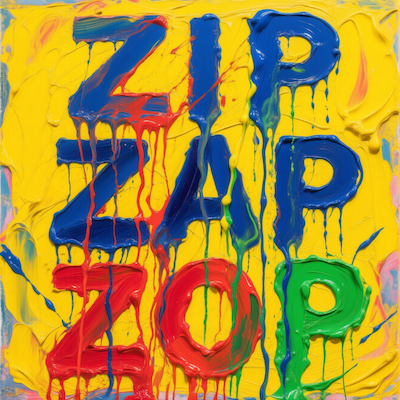
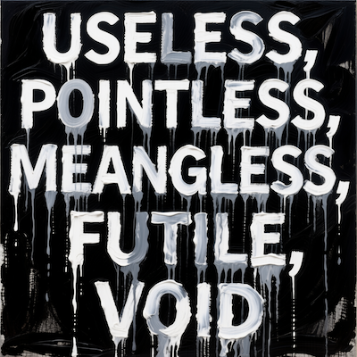
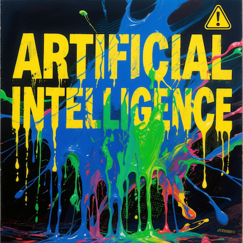

Recently Qwen has been releasing open source models at a ridiculous pace. Their latest is [Qwen-Image](https://qwenlm.github.io/blog/qwen-image/): a 20 billion parameter image generation model with a permissive Apache 2.0 license. I'm not particularly drawn to AI art, but as this is Qwen's first attempt at an image generation model, I thought I'd try it out.

The standout feature of this model is text rendering. Qwen-Image was intentionally designed with "complex text rendering" as a priority. The training data contained billions of image-text pairs... and after trying it I would say that it shows!

You need a lot of VRAM to run this model locally. The quickest way I found to try it is through their web interface at [chat.qwen.ai](https://chat.qwen.ai/). Just click on "Image Generation" and start prompting, no sign-up required.

What has me more intrigued is an editing model they've teased for a future release. It will apparently support _a suite of image understanding tasks, including object detection, semantic segmentation, depth and edge (Canny) estimation, novel view synthesis, and super-resolution_. Now that has my attention.

Until then, here are some of my Qwen-Image generations:

<i>A painting of the words "ZIP ZAP ZOP". The letters are made of extremely thick, goopy, and viscous oil paint with heavy impasto. The paint is dripping and running down the canvas, obscuring the letters. Vibrant, clashing colours like yellow, blue, red, and green. Textured oil on canvas.</i>

<i>A list of words fills the canvas: "USELESS, POINTLESS, MEANINGLESS, FUTILE, VOID". The words are painted in bold, blocky letters using thick, dripping white and grey oil paint on a black oil background. Monochromatic, highly textured.</i>

<i>A painting of the words "ARTIFICIAL INTELLIGENCE". The stencil-like letters are being covered by goopy, dripping, viscous layers of multicoloured paint, as if the raw, chaotic information is spilling out. Electric blues, digital greens, and warning-sign yellows on a dark background. Oil on canvas.</i>

