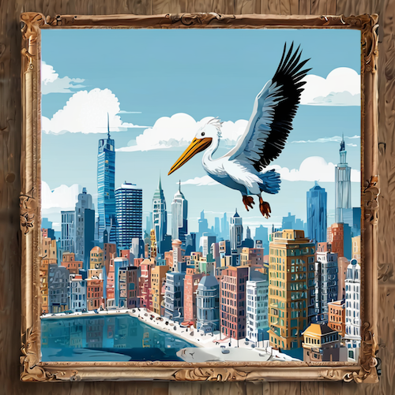

Truthfully - I know very little, so this will be a short post.

The open nature of SD has led to a huge ecosystem with thousands of customised variants. You have a vision of what you want, but starting out can feel overwhelming. There are so many options to choose from and even the slightest change can drastically alter the result. Paradoxically, the struggle to generate the "perfect image" can also drive an addiction.

From the perspective of someone who _just wanted to quickly generate some images_ for a small project, this is everything I wish I knew before I started.

1. A machine with a discrete GPU runs SD the best. [AUTOMATIC1111](https://github.com/AUTOMATIC1111/stable-diffusion-webui) is a good starting point. The UI for AUTOMATIC1111 is web based so you could even run it headless and access it via another machine, like a laptop from the couch, on the same network. [ComfyUI](https://github.com/comfyanonymous/ComfyUI) is a popular alternative but it's a graph/node based UI which adds a level of power (and complexity) that I haven't needed yet.

2. On my MacBook (a M3 Pro, 36GB), I use [Draw Things](https://drawthings.ai/). It's free and has an active and helpful Discord channel. Consider [DiffusionBee](https://diffusionbee.com/) as an alternative.

3. SDXL is a popular base model. It generates images at a native resolution of 1024 x 1024. There's SDXL Turbo but it isn't as popular because of how it has been licensed. There's also SDXL Base 8-bit which is designed to use less memory, potentially at the slight cost of image quality, but the performance seems the same. If you have no idea what to use, try SDXL.

4. At this point you can generate an image by writing a prompt that describes the image. However, the output may be very different from what you expect. If you're running on an apple silicon machine, the time for generating an image with SDXL can also be very long. On my macbook it took about 3 minutes and 45 seconds to generate one image at 30 steps with SDXL. The image quality is very good but it's a painful wait.

5. SDXL Lightning is a great way to run SDXL on a MacBook. It uses a diffusion distillation method for generating images with an extremely low number of steps. For SDXL you need around 30 sampling steps for a good image, whereas SDXL Lightning comes in 2, 4 and 8 step versions. This drastically reduces the generation time.

Confusingly, SDXL Lightning comes in two different flavours: as LoRAs and as full models. Low-Rank Adaption (LoRA) are matrices that can be applied on top of the base model to specalise it further, without needing to retrain the entire model - a very time and resource consuming task.

There are some subtle differences between using SDXL Lightning as a LoRA vs using the full model but I haven't noticed much of a difference. For now, I'm using SDXL Lightning (4 step) as a LoRA with SDXL. This is easy to do in Draw Things by selecting the model and then selecting the LoRA.

6. There are lots of different LoRAs (and models), and [https://civitai.com/](https://civitai.com/) is a great website to see example images along with the model name and LoRA used to generate them. LoRAs can stack on top of each other, so you can use multiple LoRAs to further specialise the model.

7. With SDXL Lightning (4 step) the best settings that I found were:

- Steps: 6 (can lower down to 4 but I found 6 to be the the sweet spot)
- CFG Scale: 2
- Sampler: DPM++ SDE Karras
- CLIP Skip: 2

8. Inpainting and outpainting are powerful techniques. If I generate an image but don't like part of it, I can use the eraser tool in Draw Things to erase that part. I would then write a prompt box that describes what I want to see in the erased area, and select the 100% strength setting because I don't want any influence from the existing image in the erased area. The model would then generate the missing part of the image. This is inpainting. If the new generation was good but I want to improve or modify it further, I could again erase a part but this time select a lower strength (e.g. 70%). Some of the underlying pixels would then be used to help guide the inpainting.

Outpainting is very similar and essentially fills in areas of the canvas outside the image. I found [these instructions](https://nonenonenone6.wordpress.com/) that were very helpful but it isn't clear who the author is (thank you to whoever you are!).

_A framed pelican generated using SDXL Lightning (4 step) as a LoRA with SDXL. The initial prompt was "A digital illustration of a city with a large pelican in the blue sky". Outpainting was then used to fill in the frame._